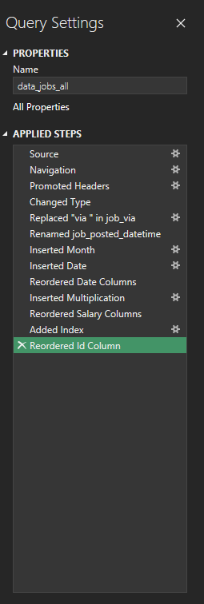
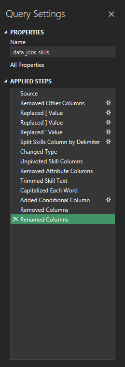
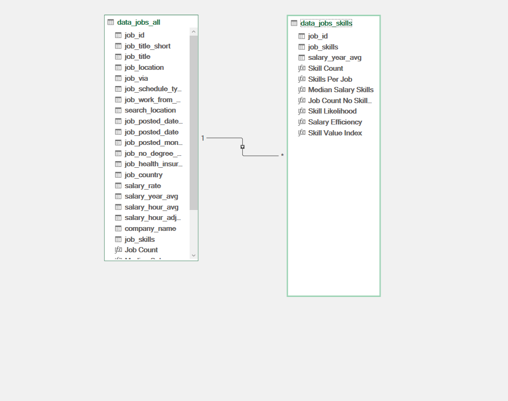
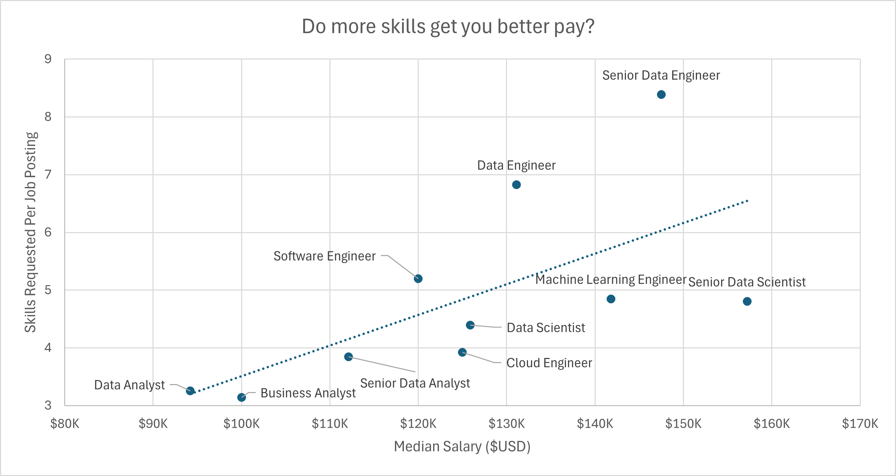
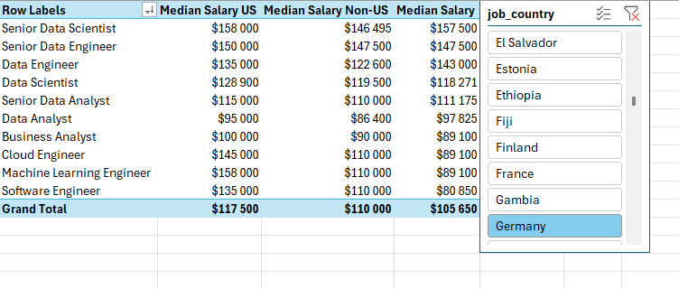
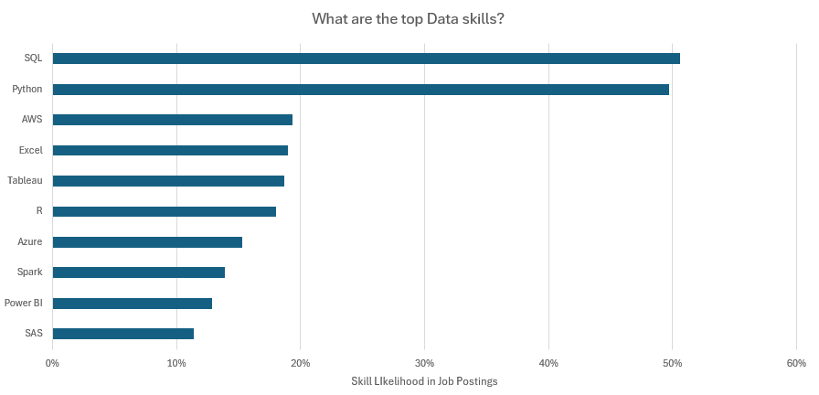
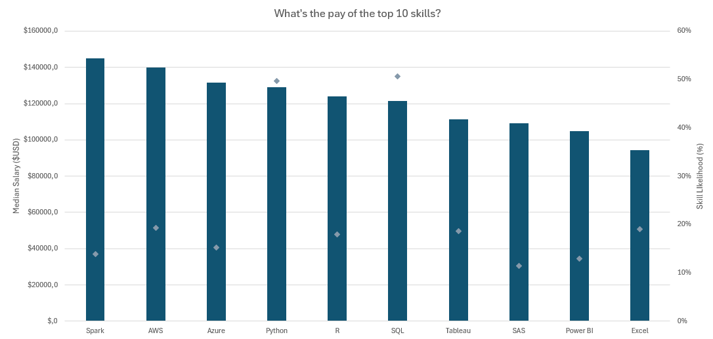
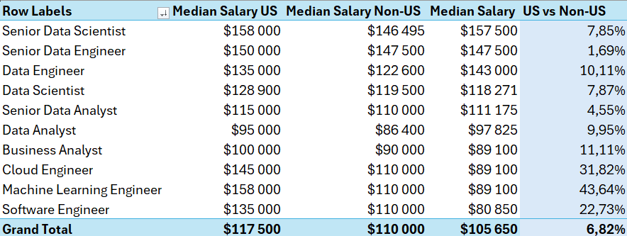
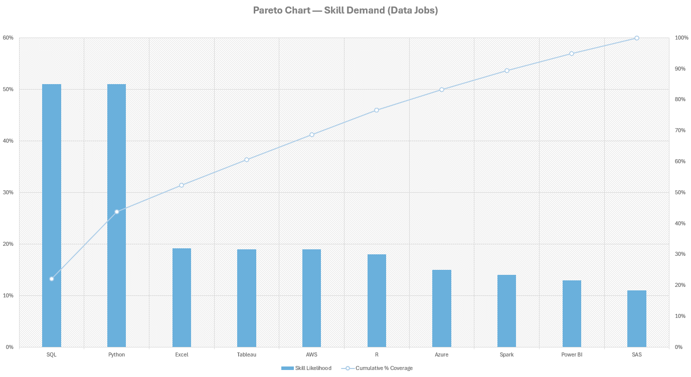

# Data Job Market Analysis (Excel)

Analysis of real data job postings (titles, salaries, locations, required skills, job type) sourced from [datanerd.tech](https://datanerd.tech/about).

## Key Findings

- SQL (~51%) and Python (~50%) appear in roughly half of all postings. Everything else drops off sharply after that.
- More required skills does not mean higher pay. Senior Data Scientists earn the most (~$157K) while requiring fewer skills (~4.8) than most senior roles. Depth beats breadth.
- Python outperforms SQL in salary (~$129K vs ~$121.5K) despite near-identical market presence.
- US salary premium is inconsistent across roles: ML Engineers see a 43.6% premium, Senior Data Engineers only 1.69%. Demand for senior data infrastructure talent is global.
- SQL, Python and Excel together cover ~52% of top-skill demand (Pareto analysis). The rest is a long tail of specialized tools.

## Tools Used

Excel, Power Query, Power Pivot, Pivot Tables & Pivot Charts, DAX

## Repo Structure

```
Images/         all charts and screenshots referenced below
data_salary_all.xlsx  source dataset
```

## Data Preparation

Loaded `data_salary_all.xlsx` into Power Query and split it into two tables: job info and skills. Cleaned unused columns, fixed data types, trimmed whitespace, loaded both into the Excel Data Model, and connected them with a 1:N relationship on `job_id`.





## 1. Skill-Pay Correlation

Does requiring more skills correlate with higher salary? Scatter plot: median salary vs average skills per job.



- Senior Data Scientists top the chart (~$157K) with fewer skills required (~4.8) than most other senior roles.
- Senior Data Engineers are the opposite: highest skill count (8), but lower median salary ($147K) than Senior Data Scientists. Technical breadth hits a pay ceiling.
- Data Analyst to Senior Data Analyst shows a clean $94K to $112K jump with only a modest skill increase, one of the more predictable progressions in the data.

## 2. Regional Salary Analysis

How much does geography impact compensation?

```dax
Median Salary :=
MEDIAN(data_jobs_all[salary_year_avg])

US Median Salary :=
CALCULATE(
    MEDIAN(data_jobs_all[salary_year_avg]),
    data_jobs_all[job_country] = "United States"
)
```



- ML Engineers and Cloud Engineers see the sharpest US premium, dropping from ~$145-158K (US) to ~$110K internationally.
- Senior Data Engineers are the exception: $150K US vs $147.5K international, almost no gap.
- Junior-to-senior analyst salary bump is larger outside the US (27.3% vs 21.1%), even though absolute US dollars still win.

## 3. Top Skills Analysis



- SQL (~51%) and Python (~50%) dominate. Next closest is AWS at ~19%.
- Among BI tools, Tableau (~19%) leads Power BI (~13%).

## 4. Financial Valuation of Skills

Which skills combine demand and compensation?



- Spark ($145K) and AWS ($140K) pay the most but have low market presence (~14% and ~19%). High pay, narrow demand.
- Python pays more than SQL (~$129K vs ~$121.5K) despite near-identical demand. SQL gets you in the door, Python pushes you higher.
- Excel has the lowest median salary (~$94K) but strong presence (~19%), a baseline tool rather than a salary driver.

## 5. Skill Efficiency Index (custom)

Standard pay correlation misses effort-to-reward. This measure shows salary per required skill.

```dax
Salary Efficiency :=
IFERROR(
DIVIDE([Median Salary], [Skills Per Job]),
BLANK()
)
```


- Senior Data Scientists, Cloud Engineers and Business Analysts lead at $31K-$33K per skill, best return in the dataset.
- General analytics roles (Data Analyst, Senior Data Analyst, Data Scientist, ML Engineer) cluster around $28.5K-$29.2K per skill.
- Senior Data Engineers have the lowest efficiency (~$17.5K per skill). High salary, but spread across a long tool list.

## 6. US Salary Premium (custom)

```dax
US vs Non-US Premium :=
IFERROR(
DIVIDE(
[Median Salary US]-[Median Salary Non-US],
[Median Salary Non-US]
),
BLANK()
)
```



- ML Engineers (43.6%) and Cloud Engineers (31.8%) have the highest US premium, both fields concentrated in US-based companies.
- Senior Data Engineers stand out again with only a 1.69% premium, confirming global demand for senior data infrastructure talent.
- For Data Analysts, the US premium shrinks from 9.95% at mid-level to 4.55% at senior level. As people specialize, international employers pay closer to US rates.

## 7. Skill Value Index (custom)

Median salary alone can mislead, a skill might pay well but barely show up in postings. This weights salary by how often the skill actually appears.

$$\text{Skill Value Index} = \text{Median Salary} \times \text{Skill Likelihood}$$

```dax
Skill Value Index :=
IFERROR(
[Median Salary] * [Skill Likelihood],
BLANK()
)
```


- Python ($64K) and SQL ($61K) dominate. Neither pays the most in isolation, but both appear in ~50% of postings.
- AWS ($27K) ranks third: strong salary, but its 19% likelihood keeps expected yield well below the top two.
- R ($22K) nearly doubles SAS ($12K), reflecting the shift away from proprietary statistical software.

## 8. Pareto Analysis: Skill Prioritization

Tested whether a small set of skills accounts for most market demand (80/20 rule).

**Method:** normalized each skill's likelihood against the top 10 total, sorted descending, built a cumulative running total, flagged anything below 60% cumulative coverage as core (tuned to 60% instead of 80%, since at 80% almost all 10 skills qualify and the analysis loses its point).

```excel
=IF(Cumulative_Coverage <= 0.60; "Top 80%"; "Tail 20%")
```



- SQL and Python together cover ~44% of total top-skill demand.
- Adding Excel pushes that to ~52%, three tools covering the majority of top-tier demand.
- Beyond those three, the curve flattens into a long tail (AWS, Tableau, Azure, Spark, Power BI, R, SAS), each adding 5-8% individually. Worth learning, but only after the core three are solid.
