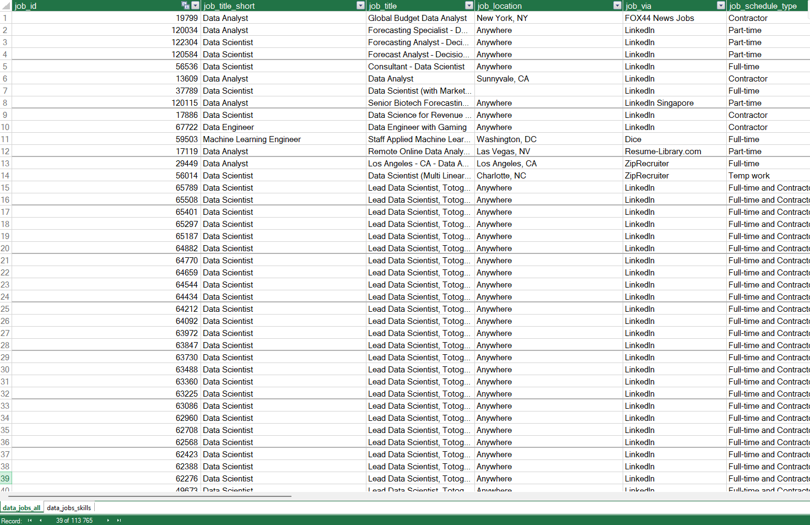

# Data Job Market Analysis — Excel + Power Pivot + DAX

**Stack:** Excel · Power Query · Power Pivot · DAX  
**Dataset:** datanerd.tech — real job postings with titles, salaries, locations, and required skills

---

## What This Project Does

Analyzes the data job market to answer one practical question:

> **Which skills should an early-career data professional prioritize — and why?**

The project combines salary analysis, demand analysis, regional comparisons, and custom DAX metrics to evaluate both market value and learning efficiency.

---

## Dataset Preparation

Raw salary data was transformed in Power Query and split into a relational model:

- Jobs table
- Skills table
- 1:N relationship via `job_id`

Cleaning included:
- data type corrections
- trimming whitespace
- removing unused columns
- loading into Excel Data Model

### Data Model



### Power Query Workflow


### Relationship Model


---

# Key Findings

- **SQL and Python appear in ~50% of postings** → strongest market coverage.
- **More skills ≠ more pay** → specialization often beats breadth.
- **Python outperforms SQL in salary** despite similar demand.
- **US premium varies heavily by role** — not every role benefits equally.
- **Skill Value Index favors high-demand skills over niche peaks.**

---

# Analysis Overview

---

## 1. Skill–Pay Correlation

Question:

> Does requiring more skills correlate with higher salary?

Scatter plot comparing:
- Median Salary
- Average Skills per Job

### Visualization


### Main Insight

Senior Data Scientists earn the highest median salary (~$157K) despite fewer listed skills than Senior Data Engineers.

---

## 2. Regional Salary Analysis

Question:

> How much does geography impact compensation?

DAX measure:

```dax
Median Salary :=
MEDIAN(data_jobs_all[salary_year_avg])

US Median Salary :=
CALCULATE(
    MEDIAN(data_jobs_all[salary_year_avg]),
    data_jobs_all[job_country] = "United States"
)
```

### Visualization


### Main Insight

US premium exists across most roles but varies substantially.

---

## 3. Top Skill Demand

Question:

> Which skills dominate the market?

### Visualization


### Main Insight

SQL and Python dominate demand.

---

## 4. Financial Valuation of Skills

Question:

> Which skills combine demand and compensation?

### Visualization


### Main Insight

Python delivers stronger salary upside than SQL.

---

## 5. Skill Efficiency Index *(Custom Metric)*

Measures financial return relative to number of required skills.

```dax
Salary Efficiency :=
IFERROR(
DIVIDE([Median Salary], [Skills Per Job]),
BLANK()
)
```

### Visualization


### Main Insight

High salary does not necessarily imply efficient skill accumulation.

---

## 6. US Salary Premium *(Custom Metric)*

Measures exact US advantage.

```dax
US vs Non-US Premium :=
IFERROR(
DIVIDE(
[Median Salary US]-[Median Salary Non-US],
[Median Salary Non-US]
),
BLANK()
)
```

### Visualization


### Main Insight

ML Engineers show the strongest US premium.

---

## 7. Skill Value Index *(Custom Metric)*

Expected salary value adjusted for market frequency.

```dax
Skill Value Index :=
IFERROR(
[Median Salary] * [Skill Likelihood],
BLANK()
)
```

### Visualization


### Main Insight

Python and SQL dominate because they combine salary with scale.

---

## 8. Pareto Analysis — Skill Prioritization

Question:

> Can a small number of skills explain most demand?

### Visualization


### Main Insight

SQL + Python account for nearly half of total top-skill coverage.

---

# Excel Skills Demonstrated

- Power Query → ingestion, cleaning, transformations
- Power Pivot → relational modeling
- DAX → custom business metrics
- Pivot Tables & PivotCharts
- Context transition
- KPI design
- Exploratory data analysis

---

## Project Outcome

Built an end-to-end Excel analytics workflow:
raw data → relational model → DAX → business interpretation → visualization
